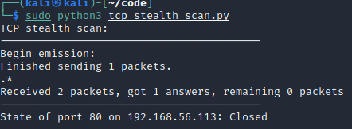
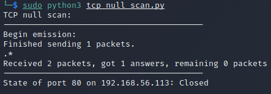

# 网络安全第五次实验 实验报告

## 实验环境

python + scapy
攻击者 Kali 172.16.111.111(有内鬼！)
靶机 Debian 192.168.56.113

## 实验目的

掌握网络扫描之端口状态探测的基本原理

## 实验要求
[x] 禁止探测互联网上的 IP ，严格遵守网络安全相关法律法规
[x] 完成以下扫描技术的编程实现：
    [x] TCP connect scan / TCP stealth scan
    - TCP Xmas scan / TCP fin scan / TCP null scan
    - UDP scan
[x] 上述每种扫描技术的实现测试均需要测试端口状态为：`开放`、`关闭`和`被过滤`状态时的程序执行结果
- 提供每一次扫描测试的抓包结果并分析与课本中的扫描方法原理是否相符？如果不同，试分析原因；
[x] 在实验报告中详细说明实验网络环境拓扑、被测试` IP `的端口状态是如何模拟的
- （可选）复刻 nmap 的上述扫描技术实现的命令行参数开关

## 实验思路

### TCP connect scan
TCP connect scan需要对一个端口复刻三次握手的完整过程，首先需要向对应端口发送一个SYN+port(n)，根据端口的开放、拒绝与被过滤三个状态对应有三种的接受结果：

1. 端口开放，则会收到SYN、ACK，此时正常发送一个ACK回去，再发送一个RST中断连接
2. 端口拒绝访问，则会直接收到RST/ACK，此时可以判断端口是关闭状态
3. 端口被过滤，则什么也不会收到，则知道端口处于被过滤状态

### TCP stealth scan
与connect scan不同的是，Stealth scan只需要发送一个SYN包启动三次握手机制，可能收到的有三种回复：

1. 接收到一个 SYN/ACK 包，表示目标端口是开放的；
2. 接收到一个 RST/ACK 包，表明目标端口是关闭的；
3. 没有响应，说明端口是被过滤的状态。

当得到的是一个 SYN/ACK 包时通过发送一个 RST 包立即拆除连接。

### TCP Xmas scan
Xmas 发送一个 TCP 包，并对 TCP 报文头 FIN、URG 和 PUSH 标记进行设置。

1. 若得到一个RST相应报文，则端口是关闭的
2. 若没有得到相应，则端口可能为开放或被过滤

### TCP finn scan
仅仅发送一个FIN结束连接的包，该包可以通过防火墙
- 如果端口是关闭的就会回复一个 RST 包
- 如果端口是开放或过滤状态则对 FIN 包没有任何响应。

### TCP null scan

发送一个 TCP 数据包，关闭所有 TCP 报文头标记。

只有关闭的端口会发送 RST 响应。

### UDP scan
UDP 是一个无链接的协议，当我们向目标主机的 UDP 端口发送数据,我们并不能收到一个开放端口的确认信息,或是关闭端口的错误信息。

- 如果收到一个 ICMP 不可到达的回应，那么则认为这个端口是关闭的
- 对于没有回应的端口则认为是开放的，但是如果目标主机安装有防火墙或其它可以过滤数据包的软硬件,那我们发出 UDP 数据包后,将可能得不到任何回应,我们将会见到所有的被扫描端口都是开放的。

## 实验结果

### 端口状态模拟的演示

由于端口状态模拟每项扫描都是一样的，因此不再在后面做重复讲述

1. 端口开放状态的模拟：
使用以下命令可以开启80端口
```
nc -l -p 80
```

对于UDP端口，则需要启用DNS服务
```
systemctl start dnsmasq
systemctl status dnsmasq
```

2.端口关闭状态的模拟：
结束上述命令的运行就可以模拟关闭状态

3.端口被过滤状态的模拟
使用iptables的命令：
```
iptables -A INPUT -p tcp --dport 80 -j REJECT
# -A 将规则添加到默认的 INPUT（入站）链的末尾的操作指令
# -p 指定特定的协议
# --dport 目的端口号

iptables -t filter -F
-t filter：对过滤表进行操作，用于常规的网络地址及端口过滤。
-F：清空列表中的所有规则。
```
若建立UDP过滤规则，则需要将端口号改为53

每次模拟被过滤状态后都需要清空过滤规则，以便于下一个实验的进行

### TCP connect scan
```python
import logging
from scapy.all import *
logging.getLogger("scapy.runtime").setLevel(logging.ERROR)

dst_ip = "192.168.56.113"
src_port = RandShort()
dst_port = 80

print('TCP connect scan:')
print('-----------------------------------------')
tcp_connect_scan_resp = sr1(IP(dst=dst_ip)/TCP(sport=src_port,dport=dst_port,flags="S"),timeout=10)
print('-----------------------------------------')


if(str(type(tcp_connect_scan_resp))=="<class 'NoneType'>"):
    print('State of port '+ str(dst_port) +' on '+ str(dst_ip) +": Closed")
elif(tcp_connect_scan_resp.haslayer(TCP)):
    if(tcp_connect_scan_resp.getlayer(TCP).flags == 0x12):       
        send_rst = sr(IP(dst=dst_ip)/TCP(sport=src_port,dport=dst_port,flags="AR"),timeout=10)
        print('State of port '+ str(dst_port) +' on '+ str(dst_ip) +": Open")
    elif(tcp_connect_scan_resp.getlayer(TCP).flags == 0x14):
        # 
        print('State of port '+ str(dst_port) +' on '+ str(dst_ip) +": Closed")
elif(tcp_connect_scan_resp.haslayer(ICMP)):
    if(int(tcp_connect_scan_resp.getlayer(ICMP).type)==3 and int(tcp_connect_scan_resp.getlayer(ICMP).code) in [1,2,3,9,10,13]):
        print('State of port '+ str(dst_port) +' on '+ str(dst_ip) +": Filtered")
```

#### open

#### close

#### filtered

### TCP SYN scan

```python
import logging
from scapy.all import *
logging.getLogger("scapy.runtime").setLevel(logging.ERROR)

dst_ip = "192.168.56.113"
src_port = RandShort()
dst_port=80

print('TCP stealth scan:')
print('-----------------------------------------')
stealth_scan_resp = sr1(IP(dst=dst_ip)/TCP(sport=src_port,dport=dst_port,flags="S"),timeout=10)
print('-----------------------------------------')

if(str(type(stealth_scan_resp))=="<class 'NoneType'>"):
    print('State of port '+ str(dst_port) +' on '+ str(dst_ip) +": Filtered")
elif(stealth_scan_resp.haslayer(TCP)):
    if(stealth_scan_resp.getlayer(TCP).flags == 0x12):
        send_rst = sr(IP(dst=dst_ip)/TCP(sport=src_port,dport=dst_port,flags="R"),timeout=10)
        print('State of port '+ str(dst_port) +' on '+ str(dst_ip) +": Open")
    elif (stealth_scan_resp.getlayer(TCP).flags == 0x14):
        print('State of port '+ str(dst_port) +' on '+ str(dst_ip) +": Closed")
elif(stealth_scan_resp.haslayer(ICMP)):
    if(int(stealth_scan_resp.getlayer(ICMP).type)==3 and int(stealth_scan_resp.getlayer(ICMP).code) in [1,2,3,9,10,13]):
        print('State of port '+ str(dst_port) +' on '+ str(dst_ip) +": Filtered")
```

#### open

#### close

#### filtered


### TCP Xmas scan

```python
from scapy.all import *
import logging
logging.getLogger("scapy.runtime").setLevel(logging.ERROR)

dst_ip = "192.168.56.113"
src_port = RandShort()
dst_port = 80

print('TCP xmas scan:')
print('-----------------------------------------')
xmas_scan_resp = sr1(IP(dst=dst_ip)/TCP(dport=dst_port,flags="FPU"),timeout=10)
print('-----------------------------------------')

if (str(type(xmas_scan_resp))=="<class 'NoneType'>"):
    print('State of port '+ str(dst_port) +' on '+ str(dst_ip) +": Filtered or Open")
elif(xmas_scan_resp.haslayer(TCP)):
    if(xmas_scan_resp.getlayer(TCP).flags == 0x14):
        print('State of port '+ str(dst_port) +' on '+ str(dst_ip) +": Closed")
elif(xmas_scan_resp.haslayer(ICMP)):
    if(int(xmas_scan_resp.getlayer(ICMP).type)==3 and int(xmas_scan_resp.getlayer(ICMP).code) in [1,2,3,9,10,13]):
        print('State of port '+ str(dst_port) +' on '+ str(dst_ip) +": Filtered")
```

#### open

#### close

#### filtered


### TCP Fin scan

```python 
import logging
logging.getLogger("scapy.runtime").setLevel(logging.ERROR)
from scapy.all import *

dst_ip = "192.168.56.113"
src_port = RandShort()
dst_port = 80

print('TCP fin scan:')
print('-----------------------------------------')
fin_scan_resp = sr1(IP(dst=dst_ip)/TCP(sport=src_port,dport=dst_port,flags="F"),timeout=10)
print('-----------------------------------------')

if (str(type(fin_scan_resp))=="<class 'NoneType'>"):
    print('State of port '+ str(dst_port) +' on '+ str(dst_ip) +": Filtered or Open")
elif(fin_scan_resp.haslayer(TCP)):
    if(fin_scan_resp.getlayer(TCP).flags == 0x14):
        print('State of port '+ str(dst_port) +' on '+ str(dst_ip) +": Closed ")
elif(fin_scan_resp.haslayer(ICMP)):
    if(int(fin_scan_resp.getlayer(ICMP).type)==3 and int(fin_scan_resp.getlayer(ICMP).code) in [1,2,3,9,10,13]):
        print('State of port '+ str(dst_port) +' on '+ str(dst_ip) +": Filtered")

```

#### open

#### close

#### filtered

> 开启与被过滤状态得到的相应都是一样的

### TCP Null scan
```python
import logging
logging.getLogger("scapy.runtime").setLevel(logging.ERROR)
from scapy.all import *

dst_ip = "192.168.56.113"
src_port = RandShort()
dst_port = 80

print('TCP null scan:')
print('-----------------------------------------')
null_scan_resp = sr1(IP(dst=dst_ip)/TCP(dport=dst_port,flags=""),timeout=10)
print('-----------------------------------------')

if (str(type(null_scan_resp))=="<class 'NoneType'>"):
    print('State of port '+ str(dst_port) +' on '+ str(dst_ip) +": Filtered or Open")
elif(null_scan_resp.haslayer(TCP)):
    if(null_scan_resp.getlayer(TCP).flags == 0x14):
        print('State of port '+ str(dst_port) +' on '+ str(dst_ip) +": Closed ")
elif(null_scan_resp.haslayer(ICMP)):
    if(int(null_scan_resp.getlayer(ICMP).type)==3 and int(null_scan_resp.getlayer(ICMP).code) in [1,2,3,9,10,13]):
        print('State of port '+ str(dst_port) +' on '+ str(dst_ip) +": Filtered")

```

#### open

#### close

#### filtered


> Null scan 可以明确检测到被过滤状态，但是不可以确定开启状态

### UDP scan

```python
import logging
logging.getLogger("scapy.runtime").setLevel(logging.ERROR)
from scapy.all import *

dst_ip = "192.168.56.113"
src_port = RandShort()
dst_port = 53
dst_timeout = 1

print('UDP scan:')

def udp_scan(dst_ip,dst_port,dst_timeout):
    print('-----------------------------------------')
    udp_scan_resp = sr1(IP(dst=dst_ip)/UDP(dport=dst_port),timeout=dst_timeout)
    print('-----------------------------------------')
    if (str(type(udp_scan_resp))=="<class 'NoneType'>"):
        retrans = []
        for count in range(0,3):
            retrans.append(sr1(IP(dst=dst_ip)/UDP(dport=dst_port),timeout=dst_timeout))
        for item in retrans:
            if (str(type(item))!="<class 'NoneType'>"):
                udp_scan(dst_ip,dst_port,dst_timeout)
        print('State of port '+ str(dst_port) +' on '+ str(dst_ip) +": Filtered or Open")
    elif (udp_scan_resp.haslayer(UDP) or udp_scan_resp.getlayer(IP).proto == IP_PROTOS.udp):
        print('State of port '+ str(dst_port) +' on '+ str(dst_ip) +": Open")
    elif(udp_scan_resp.haslayer(ICMP)):
        if(int(udp_scan_resp.getlayer(ICMP).type)==3 and int(udp_scan_resp.getlayer(ICMP).code)==3):
            print('State of port '+ str(dst_port) +' on '+ str(dst_ip) +": Closed")
        elif(int(udp_scan_resp.getlayer(ICMP).type)==3 and int(udp_scan_resp.getlayer(ICMP).code) in [1,2,9,10,13]):
            print('State of port '+ str(dst_port) +' on '+ str(dst_ip) +": Filtered")

udp_scan(dst_ip,dst_port,dst_timeout)

```


#### close

#### filtered


## 遇到的问题

1. 运行python脚本需要使用sudo权限，且需要`python3 xxx.py`
2. 模拟udp端口被过滤状态时，如果使用`iptables -A INPUT -p udp --dport 53 -j REJECT`，则会连同udp scan发送的包一同过滤，因此需要改成`iptables -A INPUT -p tcp --dport 53 -j REJECT`

## 参考资料

- [Scapy](https://scapy.readthedocs.io/en/latest/)

- [网络安全第五章课件](https://c4pr1c3.github.io/cuc-ns/chap0x05/main.html)

- [EddieXu1125](https://github.com/CUCCS/2021-ns-public-EddieXu1125/tree/chap0x05/chap0x05)