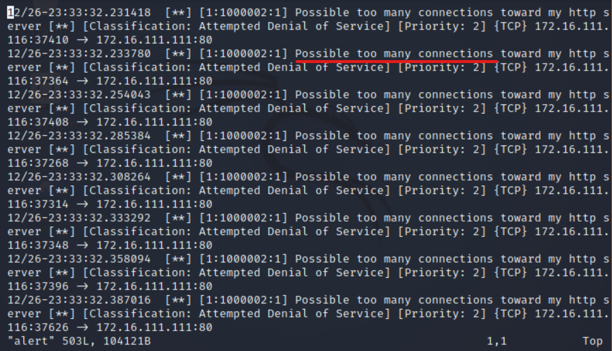

# 入侵检测实验
## 拓扑结构
- 以gateway作为网桥，attacker与victim在同一个子网下

- attacker与victim之间可以相互连通

## 实验一：配置snort为嗅探模式

```
snort -q -v -b -i eth0 "port not 22"
```
- 开启嗅探之后，打开浏览器随便访问几个网页，sudo su切换至root用户查看日志

## 实验二：配置并启用snort内置规则

- 将`/etc/snort/snort.conf` 中的 HOME_NET 和 EXTERNAL_NET 定义为 `any`


## 实验三：自定义snort规则

- 新建自定义 snort 规则文件
- 意思是当任意来源来自任意端口的tcp报文到达80端口时发送警报
```
vim qlr.rules
alert tcp \$EXTERNAL_NET any -> \$HTTP_SERVERS 80 (msg:"Access Violation has been detected on /etc/passwd ";flags: A+; content:"/etc/passwd"; nocase;sid:1000001; rev:1;)
alert tcp \$EXTERNAL_NET any -> \$HTTP_SERVERS 80 (msg:"Possible too many connections toward my http server"; threshold:type threshold, track by_src, count 100, seconds 2; classtype:attempted-dos; sid:1000002; rev:1;)
```
保存并退出
添加配置代码到 /etc/snort/snort.conf
```
include $RULE_PATH/qlr.rules
```

被攻击者开启嗅探
```
snort -q -A fast -b -i eth0 -c /etc/snort/snort.conf -l /var/log/snort/
```
攻击者进行压力测试(victim打开apache2服务)
```
ab -c 100 -n 10000 http://172.16.111.1111/hello
```

这是snort捕捉到的信息（日志名为alert），正如输入的规则所示，弹出来警告（Possible too many connections toward my http server)。

如果使用
```
ab -c 100 -n 100 http://172.16.111.111//etc/passwd
```
进行攻击的话，就会警报（Access Violation has been detected on /etc/passwd ）;

## 实验四：和防火墙联动

- 在victim中：
```
# 解压缩 Guardian-1.7.tar.gz
tar zxf guardian.tar.gz

# 安装 Guardian 的依赖 lib
apt install libperl4-corelibs-perl

# 先开启 snort
snort -q -A fast -b -i eth0 -c /etc/snort/snort.conf -l /var/log/snort/

# 再在另一个终端中
cd /Desktop/guardian

# 编辑 guardian.conf 并保存，确认以下2个参数的配置符合主机的实际环境参数。
HostIpAddr      172.16.111.111
Interface       eth0

# 启动 guardian.pl
perl guardian.pl -c guardian.conf
```

- 在attacker中：
```
# nmap 暴力扫描 victim
nmap 172.16.111.111 -A -T4 -n -vv
```
guardian已经探测到了nmap扫描

在alert日志中也记载了此次警告

